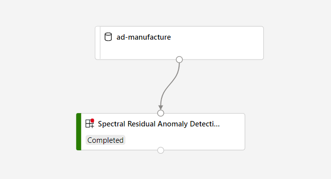

# Spectral Residual Anomaly Detection 

## Overview

This pipeline builds a time-series anomaly detection model which can help customers monitor time-series and detect incidents with [spectral residual anomaly detection component](https://github.com/microsoft/anomalydetector/blob/master/aml_component/ad_component.yaml).

#### You will learn how to:

Build pipeline with newly created components and a manufacture sample dataset.

## Prerequisites

- [Create related components in your workspace](../../tutorial/tutorial1-use-existing-components.md). Component spec can be found [here](https://github.com/microsoft/anomalydetector/blob/master/aml_component/ad_component.yaml).

    | Component spec               | Description                                                  |
    | --- |--- |
    |[Spectral Residual Anomaly Detection](https://github.com/microsoft/anomalydetector/blob/master/aml_component/ad_component.yaml)| Detect anomlies based on spectral residual anomaly detection algorithm.|

## Build the pipeline

1. Register this [AnomalyDetector-Manufacture dataset](https://github.com/microsoft/Cognitive-Samples-IntelligentKiosk/blob/master/Kiosk/Assets/AnomalyDetector/AnomalyDetector-Manufacture.csv) as **Tabular dataset** in your Azure Machine Learning workspace.

    The dataset above is a sample dataset. You can use your own dataset, make sure that it is registered as Tabular dataset and you can also preprocess your dataset using Designer built-in modules. Make sure that the input dataset of **Spectral Residual Anomaly Detection** is with following format, and the count of time series must be more than 12:

    |Timestamp|Value|
    |---|---|
    |2018/7/1 0:00|22|
    |2018/7/1 2:00|22|
    |2018/7/1 4:00|22|
    |2018/7/1 6:00|22|
    |2018/7/1 8:00|52.93218322|
    |2018/7/1 10:00|52.81943684|
    |2018/7/1 12:00|52.33277765|
    |2018/7/1 14:00|52.82106858|
    |2018/7/1 16:00|52.93218322|
    |2018/7/1 18:00|22|
    |2018/7/1 20:00|22|
    |2018/7/1 22:00|22|
    |2018/7/2 0:00|22|
    |2018/7/2 2:00|22|
    |2018/7/2 4:00|22|
    |2018/7/2 6:00|22|

1. Add **Spectral Residual Anomaly Detection** to canvas, connect it to the dataset, and configure the parameters. The pipeline graph is like following:

    

1. Submit the pipeline.
1. When the pipeline runs completed, you can click on **Visualize** icon in the **Outputs+logs** tab in the right panel of the **Spectral Residual Anomaly Detection** module, or right-click the module to select **Visualize**.

    The output including following columns according to the `detect_mode` parameter.
    
    In _AnomalyOnly_ mode, the following columns will be output:
    * `isAnomaly`. The anomaly result.
    * `mag`. The magnitude after spectral residual transformation.
    * `score`. A value indicates the significance of the anomaly.
    
    In _AnomalyAndMargin_ mode, the following columns will be output in addition the the above three columns.
    * `expectedValue`. The expected value of each point.
    * `lowerBoundary`. The lower boundary at each point that the algorithm can tolerant as not anomaly.
    * `upperBoundary`. The upper boundary at each point that the algorithm can tolerant as not anomaly.

## Reference papers
- [Ren, Hansheng et al. “Time-Series Anomaly Detection Service at Microsoft.” Proceedings of the 25th ACM SIGKDD International Conference on Knowledge Discovery & Data Mining (2019): n. pag. Crossref. Web.](https://arxiv.org/abs/1906.03821#:~:text=At%20Microsoft%2C%20we%20develop%20a%20time-series%20anomaly%20detection,is%20designed%20to%20be%20accurate%2C%20efficient%20and%20general)

| Contributed by | Maintained by | Category | Tags | Last update | 
|---|---|---|---|---|
| Microsoft | @Microsoft Open Source | Tutorials |recommendation| September 4, 2020 |

