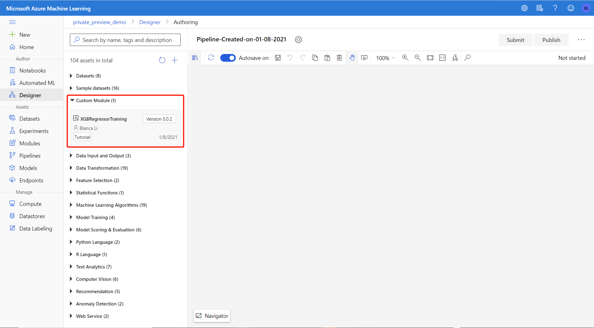

# Tutorial-1 Use existing components from gallery

A component is self-contained set of code that performs one step in machine learning pipeline, such as data preprocessing, model training, model scoring and so on. A component is analogous to a function, in that it has a name, parameters, expects certain input and returns some value. Any python script can be wrapped as a component following the [component spec](component-spec-definition.md).

Azure Machine Learning Gallery contains rich components and pipelines for common machine learning tasks. It accelerates the productivity by enabling customer easily leveraging best work of the community instead of start from zero. 

In this tutorial you will learn how to build a machine learning pipeline with existing components in the gallery. It can be summarized as two steps:
 1. Register the components to your Azure Machine Learning workspace.
 2. Build the pipeline using the registered components in Azure Machine Learning designer.

> **! NOTE:**  
>
> **Components** equals to **Modules** in Azure Machine Learning studio UI.

This tutorial will use Automobile Price Prediction as an example. The related components can be found under components/automobile-price-prediction.

## 1. Register existing components from gallery

To use components from this gallery and build a pipeline, you need to register components to your Azure Machine Learning workspace at first.

This tutorial will explain how to register component from the gallery with 3 sample components (cleanse, merge, filter) under folder components/nyc-taxi-fare-prediction.

1. Go to ml.azure.com and select your workspace.

    > **! NOTE:**  
    >
    > Please open designer before you do following steps if you never opened designer in your workspace before. This is to make sure the needed data type is registered to the workspace and then you can registered components successfully to workspace.  

1. Add **&flight=cm** at end of the URL of your workspace to enable components feature. You will see **Modules** tab under Assests blade on the left navigation area. 

    
    
1. Click *Create new component -> From YAML file*. Choose Github repo as source. Fill in the URL of cleanse component YAML spec file (https://github.com/Azure/AzureMachineLearningGallery/blob/main/components/automobile-price-prediction/xgboost-regressor-training/XGBRegressorTraining.spec.yaml).

    
    

1. Follow the wizard to finish the creation. 
    
    After creation, you will see the component both in component tab and Designer module palette on the left of authoring page. 
    [TODO] update screenshot
    

## 2. Use registered component to build pipeline in designer

Azure Machine Learning designer is the UI interface to build machine learning pipelines. It provides an easy drag-n-drop interface to build, test and manage your machine learning pipelines. 

1. Open a new pipeline in the designer.

1. Drag **Automobile price data (Raw)** dataset to canvas. You can find it under **Sample datasets** in the module tree to the left of canvas. You can right click the dataset and click **Visualize** to preview the data.

1. Drag the following components to canvas and config parameters in right panel of each module as following:

    |Module|Parameter|
    |---|---|
    |**Select Columns in Dataset**| Click **Edit column**, and select Include **Column types** -> **Numeric**. This is because this XGBRegressor component can only process numeric features.
    |**Clean Missing Data**| Click **Edit column**, and select Include **All columns**. This is to clean missing data in the dataset.
    |**Split Data**| **Splitting mode** is by default set as *Split Rows*. You can set split fraction of rows.
    |**XGBRegressorTraining**| **Label_Col**: Input *price* - the label column name.  **Model_FileName**: Input the output model name, e.g.*xgb_modelfile.json*.  **Learning_rate**: Set the learning rate of XGBRegressor, by default 0.1.   **Max_depth**: Maximum tree depth for base learners, by default 5.

1. Connect them to build the pipeline like following graph. 

    

1. Submit a run.
    
    Select a compute target and submit a run. 

1. Check result of the run.
    
    If the run finish successfully, each component's output will be stored in the workspace default blob. 
    You can access the output in storage account by **View Output** in the right click menu of the component. The output is a json file of the trained XGBRegressor.

    If the run failed, check the 70_driver_log under Outputs + Logs to troubleshot. 
  

## Next step
This tutorial goes through how to use existing components from the gallery to build a machine learning pipeline. Follow the [second part of the tutorial](./tutorial2-create-your-component.md) to learn how to create a component with your own code. 
