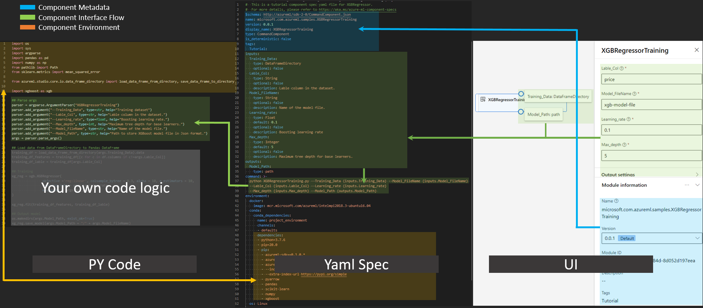
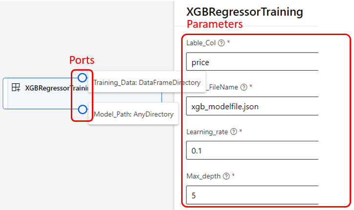
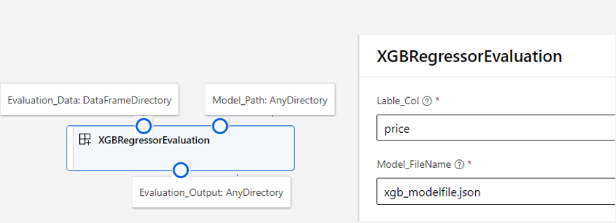
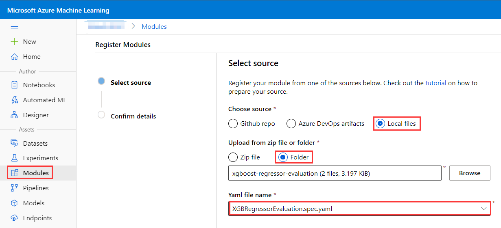
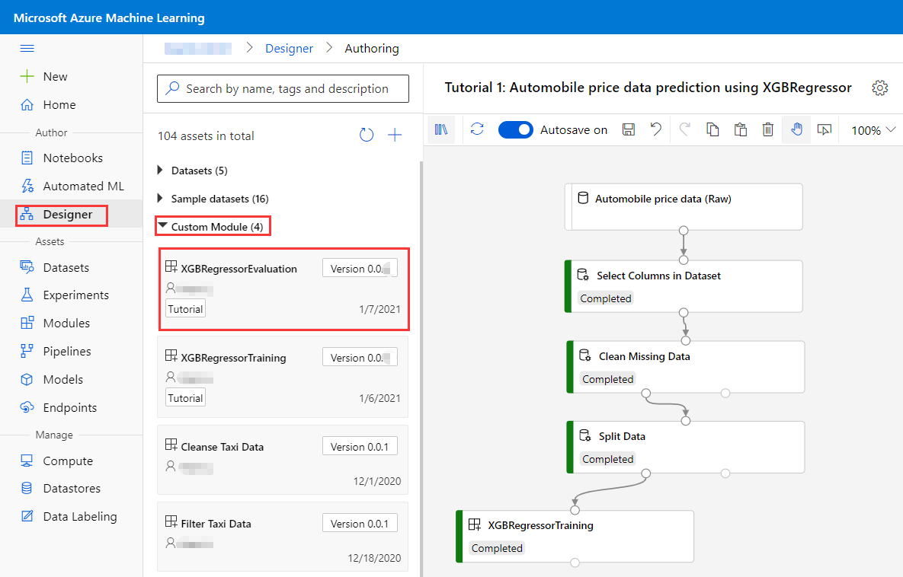

# Tutorial 2: Create your own component
In [tutorial 1](./tutorial1-use-existing-components.md), we created a pipeline which is constructed by build-in components and existing components in this gallery. In this tutorial, we will continue this story to introduce how to create your own component. 

## Component example
In [tutorial 1](./tutorial1-use-existing-components.md), we registered __XGBRegressorTraining__ component from gallery to your workspace. Let's use this component as an example to understand the constitution of a component.

In general, Azure Machine Learning component is constituted by 2 files: 
1. Component specification in Yaml format. [__XGBRegressorTraining__](../components/automobile-price-prediction/xgboost-regressor-training/XGBRegressorTraining.spec.yaml) is the Yaml file for our example . This file defines the component from several parts:
    - Metadata. e.g. __name, display_name, type, tags__.
    - Interface. __Inputs__ and __outputs__ of the component.
    - Implementation. For CommandComponent, __Command__ is the 1-line command line which will be executed.
    - Environment. __environment__ section defines the docker image and other dependencies.
2. Relative Python code which includes your own logic. [__XGBRegressorTraining__](../components/automobile-price-prediction/xgboost-regressor-training/XGBRegressorTraining.py) is the python file for our example.

The correlation between component UI, Yaml spec and Py code is illustrated as below:


Useful tips about the Yaml spec:
> - Component name constraints. 
> _Name_ is the unique identifier across all components. Currently, name only accept letters, numbers and '-._'.

> - Component type & schema. 
> Currently, Azure Machine Learning customized component only support __CommandComponent__. The _schema_ and _type_ settings are fixed values right now to support CommandComponent.

> - Data interface. 
> __DataFrameDirectory__ is the common data interface when uses Azure Machine Learning datasets across different components. This type could be easily transformed to Pandas DataFrame. It is suggested to use DataFrameDirectory as the data inputs/outputs when you define your components.

> - Port & Parameters between UI and Yaml Spec.
> From component UI, there has 2 types of inputs/outputs: __Ports__ and __Parameters__.
> 
> When you use _DataFrameDirectory_ or _AnyDirectory_ as an input/output type, it will be shown as __port__. When you use basic type, like _integer_, _float_ or _string_, it will be shown in __parameters__ right panel. 

You could refer to '_[component spec definition](../component-spec-definition.md)_' for more details about the Yaml Spec settings and examples.

## Build XGBRegressorEvaluation component
Let's start creating a new customized component! After trained the XGBoost regressor model for predicting automobile price, we plan to have a new component, __XGBRegressorEvaluation__, to evaluate the performance of this newly trained model. We could define this new evaluation component interface as below:


### Yaml spec
Now, you could try to create Yaml file for this component to fit XGBRegressorEvaluation definition. You could copy our [__Yaml template__](./resources/component_yaml_template.yaml) to start and then refer to [XGBRegressorTraining](../components/automobile-price-prediction/xgboost-regressor-training/XGBRegressorTraining.spec.yaml) Yaml example to help you fill the content. You could also check our finalized yaml spec [__XGBRegressorEvaluation__](../components/automobile-price-prediction/xgboost-regressor-evaluation/XGBRegressorEvaluation.spec.yaml) when you finish your file or need some suggestions.

### Py code
To achieve evaluation goal, we plan to use 'Root-Mean-Square Error (RMSE)' method from sklearn.metrics. Now, the core pseudo code to evaluate a given model is illustrated as below:
```python
## Load model
import xgboost as xgb
xg_reg = xgb.XGBRegressor()
xg_reg.load_model("xgboost_modelfile.json")

## Evaluation
import numpy as np
from sklearn.metrics import mean_squared_error
preds = xg_reg.predict(evaluationData_features)
rmse = np.sqrt(mean_squared_error(evaluationData_lable, preds))
print("RMSE: %f" % (rmse))
```

To upgrade these pseudo code to fit XGBRegressorEvaluation defination, we need 2 steps: 
1. Parse the inputs from args.
2. Prepare your data for prediction and evaluation.

You could try to follow the [XGBRegressorTraining](../components/automobile-price-prediction/xgboost-regressor-training/XGBRegressorTraining.py) py code for an example. We also prepared a finalizaed [__XGBRegressorEvaluation py code__](../components/automobile-price-prediction/xgboost-regressor-evaluation/XGBRegressorEvaluation.py) for your reference.

## Register component from local
When the Yaml Spec and Py code are ready, you could either edit them from example or download them from this folder directly, we could follow the register guidance in [tutorial 1](./tutorial1-use-existing-components.md) to register our XGBRegressorEvaluation component through Azure Machine Learning Modules page. The only difference is that you need register the component from 'Local files' and choose the right path where contains the Yaml Spec and Py code:



Then click 'Next' and 'Create' for finish the creation of XGBRegressorEvaluation component. You will see the new component is listed in Module page.


## Update pipeline
Now let's use our new component to evaluate the output module from the pipeline we created in tutorial 1.  

Go to the 'Designer' page, select Tutorial 1 pipeline, and find the XGBRegressorEvaluation component under 'Custom Module' collection:


Drag this component to the canvas and link it to precedent components and define its parameter values:
 - The second output of __'Split Data'__ component is the data input as evaluation data set.
 - __'XGBRegressorTraining'__ output the model directory. This is the input model directory for XGBRegressorEvaluation component.
 - Put __'price'__ as the value of __'Lable_Col'__.
 - Put __'xgb_modelfile.json'__ as the value of __'Model_FileName'__. 


At last we could submit the new pipeline with new component to evaluate our model performance.

## Contribute back to gallery
Azure Machine Learning Gallery always welcomes contributor to enrich the gallery with more components or pipelines. Once your component is ready to serve your scenario, please consider sharing it into the gallery to help all developers on the productivity. Refer to this [__link__](../components/README.md) to start sharing your component into gallery.
